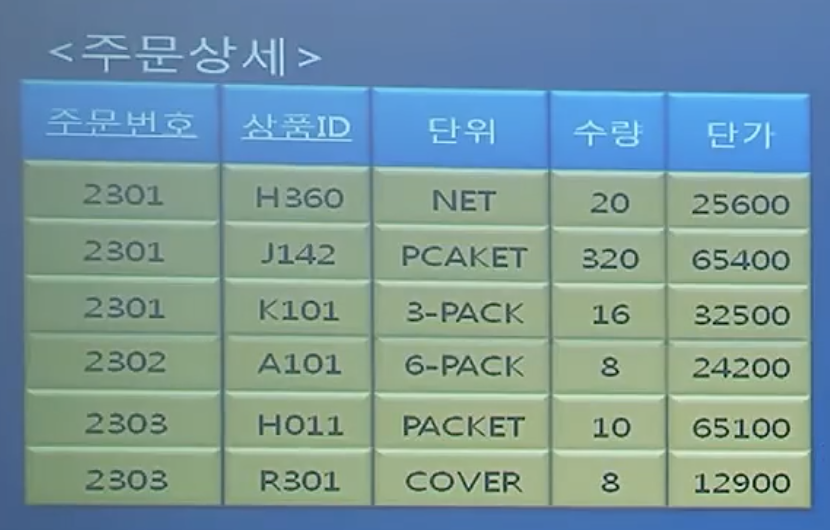
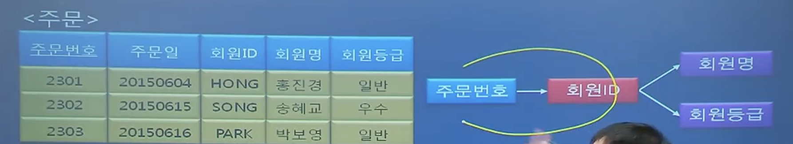

# 1. 외래키
## 외래 키

- 관계형 데이터베이스에서 한 테이블의 필드 중 다른 테이블의 행을 식별할 수 있는 키를 말함
- 아래와 같이 주인과 동물의 관계를 나타내는 두 개의 테이블이 있는 경우 주인_id라는 외래키를 통해서 다른 테이블 행을 식별하여 자기 주인과 연결할 수 있다.

**주인 테이블(Owner)**

| owner_id | 이름 |
| --- | --- |
| 1 | 철수 |
| 2 | 영희 |

**동물 테이블(Pet)**

| pet_id | 이름 | 주인_id |
| --- | --- | --- |
| 101 | 뽀미 | 1 |
| 102 | 루루 | 2 |

## 실무에서 외래키를 사용하지 않는다는데?

- 외래키 장점
    - 데이터 무결성: 데이터베이스가 참조 무결성을 자동으로 보장 > 잘못된 삽입삭제 방지
    - 데이터 정합성: 부모-자식 관계 유지하여 논리적으로 잘못된 데이터 방지
- 외래키 단점: 데이터 끼리의 관계가 명확하게 연결되어, 데이터 무결성을 보장하고 관계를 강제하지만 유연성과 성능을 저하시킬 우려
    - INSERT: 자식 테이블에 데이터 삽입 시 부모 테이블의 참조 키 존재 여부 확인하는 추가 SELECT 쿼리 실행
    - UPDATE: 자식 테이블 값 변경 시 부모 테이블에서 참조 키 확인하거나, 참조 무결성을 위해 추가 검증 작업 발생
    - DELETE: 부모 테이블 데이터 삭제 시 자식 테이블에서 참조중인 데이터가 있는지 확인, CASCADE 옵션이 설정된 경우 자식 데이터를 삭제할 수 있음
- 실무에서 주로 사용하지 않는 이유
    - 실무에서는 수작업으로 데이터 다루는 경우가 빈번
    - 문제가 생겨 빠르게 수작업 처리해야하는 경우, 외래키에 의해 처리가 늦어짐
    - 데이터베이스 설계 시 초기에 잘 설계 했더라도 시간이 지나며 추가 개발과 설계가 수정되어질 수 있음
    - 테스트 환경에서 불편함, 운영환경에서 불편, 데이터베이스 확성장 문제
- 외래 키 대체 방안
    - join을 통해서 두 테이블 결합하기. 데이터 불일치 문제가 발생할 수 있음
    - UNIQUE 및 INDEX 사용
    - 데이터 무결성을 DB 자체에서 검사가 아닌, 코드상에서 검사로 관리 가능
- 외래키 적합한 경우
    - 작은 규모 애플리케이션
    - 결제 및 재무 데이터

## Reference

https://ko.wikipedia.org/wiki/%EC%99%B8%EB%9E%98_%ED%82%A4

https://geumjulee.tistory.com/80

# 2. 기본키
관계형 DB에 각 행을 고유하게 식별하는 데 사용되는 키, 중복된 값을 가질 수 없고 NULL을 허용하지 않음

# 3. ER 다이어그램

- 데이터 모델링 시 개체-관계 모델이란 구조화된 데이터에 대한 일련의 표현
- 개체 간의 관계에 따라 두 개체의 관계를 잇는 선의 종류가 달라짐

# 4. 복합키
- 단일 컬럼으로는 고유성 보장할 수 없을 때 두 개 이상의 컬럼을 조합해 기본키로 지정하는 것
- 기본키와 마찬가지로 null값을 가질 수 없음

# 5. 연관관계

한 객체 또는 클래스가 다른 객체 또는 클래스와 상호작용하지만, 그 생명주기를 서로에게 의존하지 않는 관계

- 1대1 관계: 한 유저는 하나의 주소, 한 주소는 하나의 유저
- 1대다 관계: 책과 리뷰
- N:M관계: 양쪽 모두에서 1:N 관계를 가지는 것

# 6. 정규화
## Normalization

- 테이블을 관계에 따라 분리하며 DB를 구조화시키는 과정

## 과정

- 제1정규형 > 컬럼의 값이 하나만 갖도록
    - 수강과목 컬럼에 “수학,영어” 두 개가 들어있으면 안됨!
    - 두 열로 쪼개기
    - 하지만 원자값을 기준으로 한다는 설명은 애매하다

<aside>

모든 열과 행의 중복지점에서는 (열과 행의) 해당되는 분야에서 한 개의 값(single value)을 가짐

</aside>

- 제2정규형
    - 1정규형 만족
    - 부분적 함수 종속 제거
    - PK가 여러 키로 구성된 복합키로 구성된 경우, 복합키 전체에 의존하지 않고 복합키의 일부분에만 종속되는 속성이 있을경우! 분리
    - 아래 테이블 예시에서 [주문번호, 상품 ID]가 복합키이다.
        
        
        
    - 주문번호가 수량을 결정하는것도, 상품 ID가 수량을 결정하는 것도 아니다. 고유한 어떠한 주문 번호에, 상품 ID가 결정이 되어야 해당 수량을 알 수 있다.
        
        
        
    - 대신 단위와 단가는 상품 ID만 알아도 알 수 있는 부분이기 때문에 “부분 함수 종속”이 발생한다.
    - 아래처럼 두 테이블을 분리해야한다.
        
        
        

<aside>

키가 아닌 모든 속성들이 기본키에 완전 함수 종속 되어야한다.

</aside>

- 제3정규형
    
    
    

<aside>

테이블의 키가 아닌 모든 속성들이 기본 키에 이행적으로 함수종속되지 않은 관계가 있다면 분리해야한다.

</aside>

## 무손실 분해

- 분해했던 테이블을 join하면 원래 테이블이 나와야한다. 추가되거나 삭제되는 데이터가 없어야한다.

## Video

[정보처리 실기_데이터베이스06강_정규화](https://youtu.be/RXQ1kZ_JHqg?si=f0OPsoOWnJXSbqca)

# 7. 반 정규화

반정규화는 데이터베이스 성능향상을 위해, 데이터 중복을 허용하고 조인을 줄이는 데이터베이스 성능향상방법이다.

조회 속도는 향상시키지만, 데이터 모델의 유연성은 낮아지는 단점이 있다.

## 주요 기법

- 테이블 합병: 논리적 모델 상 구분되어야하지만, join을 줄이기 위해 사용
- 중복 칼럼 추가: 게시판 테이블에 회원 정보를 일부 저장해놓아, join없이 처리하기
- 계산된 칼럼 추가: 자주 사용되는 계산값들은 DB에 저장해두기
- 코드 명칭 칼럼 추가: 남자 여자를 F,M이 아니라 남자, 여자로 저장 > 출력 시 남자, 여자로 보여줘야하는 경우 연산 줄임