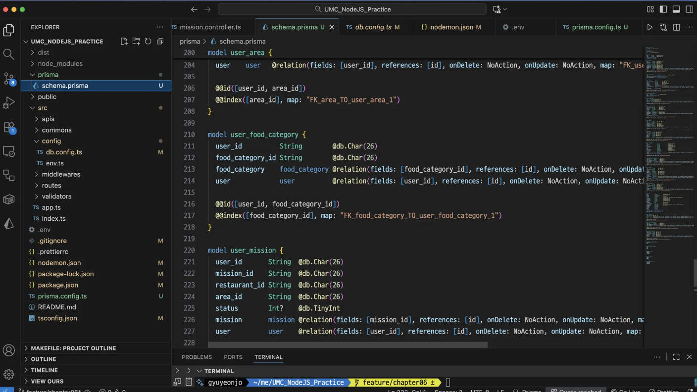
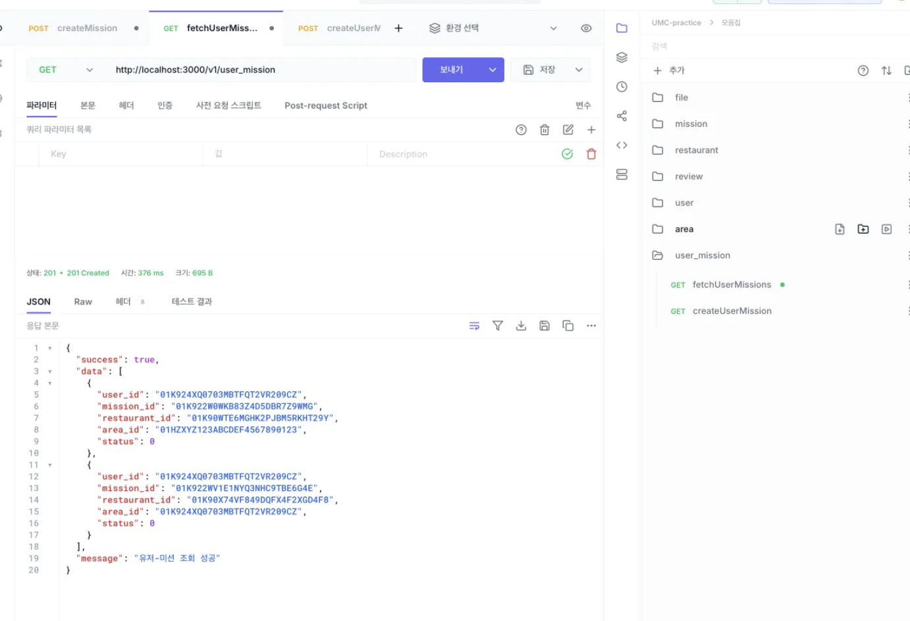
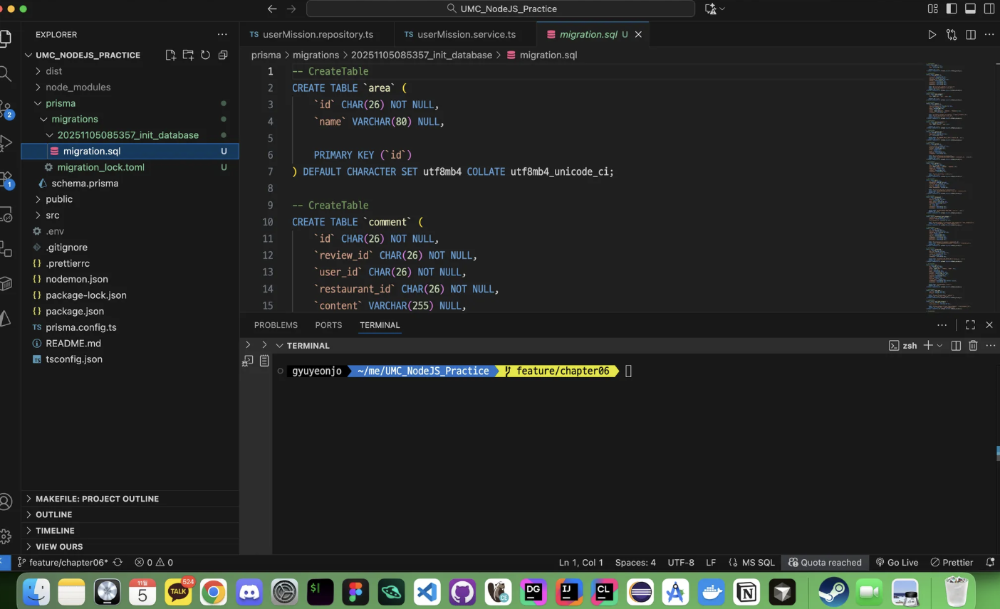
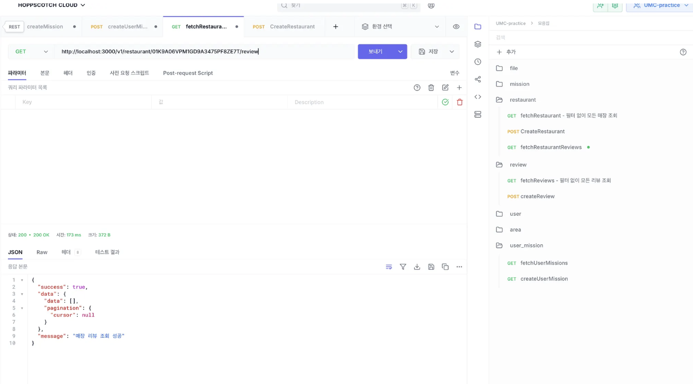

# 1. orm 사용해보기

## 1-1) npx prisma db pull



## 1-2) 기존 API 호환 확인 > 정상 작동



# 2. 마이그레이션



# 3. 목록 조회하기 (페이지네이션)



```tsx
  async findByRestaurantId(restaurant_id: string, cursor: string) {
    const reviews = await this.prisma.review.findMany({
      select: {
        id: true,
        content: true,
        restaurant: true,
        user: true,
      },
      where: { restaurant_id, id: { gt: cursor } },
      orderBy: { id: 'asc' },
      take: 5,
    });
    return responseFromReviews(reviews); // dto 적용하여 다음 커서 추가 후 반환
  }
```
