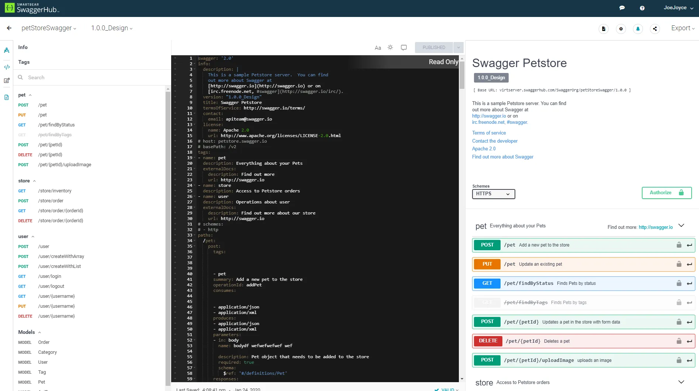

- Swagger
    
    swagger는 API 문서를 생성할 때 문서를 개발자가 직접 작성하지 않아도 되기 때문에 개발 시간을 단축할 수 있다. 추가로 swagger ui로 손쉽게 api를 테스트할 수 있으며, 호출 시 전달해야할 파라미터를 확인 가능하다.
    
    ## swagger UI
    
    OAS 명세를 읽어 상효 작용 가능한 웹 페이지 형태의 문서를 생성 (가장 널리 사용하는 형태)
    
    
    
    ## swagger Editor
    
    OAS 명세를 yaml/json으로 작성하고, 실시간으로 스웨거 ui를 통해 미리보기를 제공하는 에디터
    
    
    
    ## swagger codegen
    
    OAS 명세 파일에서 서버/클라이언트 코드를 자동 생성하는 도구
    
    현재는 OpenAPI Generator가 더 활발하게 개발 및 유지보수 되고 있음
    
- OpenAPI
    
    ## open api
    
    rest api를 문서화하고, 규격화하고, 자동화하기 위한 표준 사양을 뜻함
    
    ## 어디에 사용될까?
    
    - api 문서 자동 생성
    - 클라이언트/서버 코드 자동 생성
        - openapi 스펙 기반으로 서버 스켈레톤 코드 및 프론트/백엔드 http 클라이언트 자동 생성
    - api 테스트 자동화
    
    ```yaml
    openapi: 3.0.0
    info:
      title: Example API
      version: 1.0.0
    
    paths:
      /users:
        get:
          summary: Get users
          responses:
            200:
              description: OK
    # 이 yaml파일을 통해 swagger ui에서 자동으로 api 문서 생김
    ```
    
    ## swagger vs openapi
    
    openapi는 표준 스펙이고,
    
    스웨거는 Openapi를 사용하기 위한 도구 모음이다!
    
- OpenAPI Component
    
    ## 컴포넌트 사용 예시
    
    - 유저 스키마 정의하고 다른 엔드포인트에서 참조하기
    
    ```yaml
    components:
      schemas:
        User:
          type: object
          properties:
            id:
              type: integer
            name:
              type: string
            email:
              type: string
    ```
    
    ```yaml
    responses:
      200:
        description: OK
        content:
          application/json:
            schema:
              $ref: '#/components/schemas/User'
    ```
    
    - 공통 에러 응답 정의하기
    
    ```yaml
    components:
      responses:
        UnauthorizedError:
          description: Access token is missing or invalid
    ```
    
    ```yaml
    responses:
      401:
        $ref: '#/components/responses/UnauthorizedError'
    ```