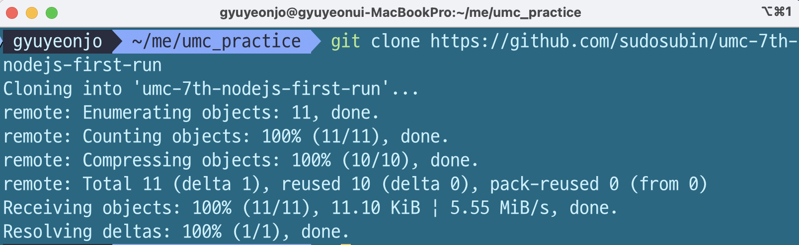
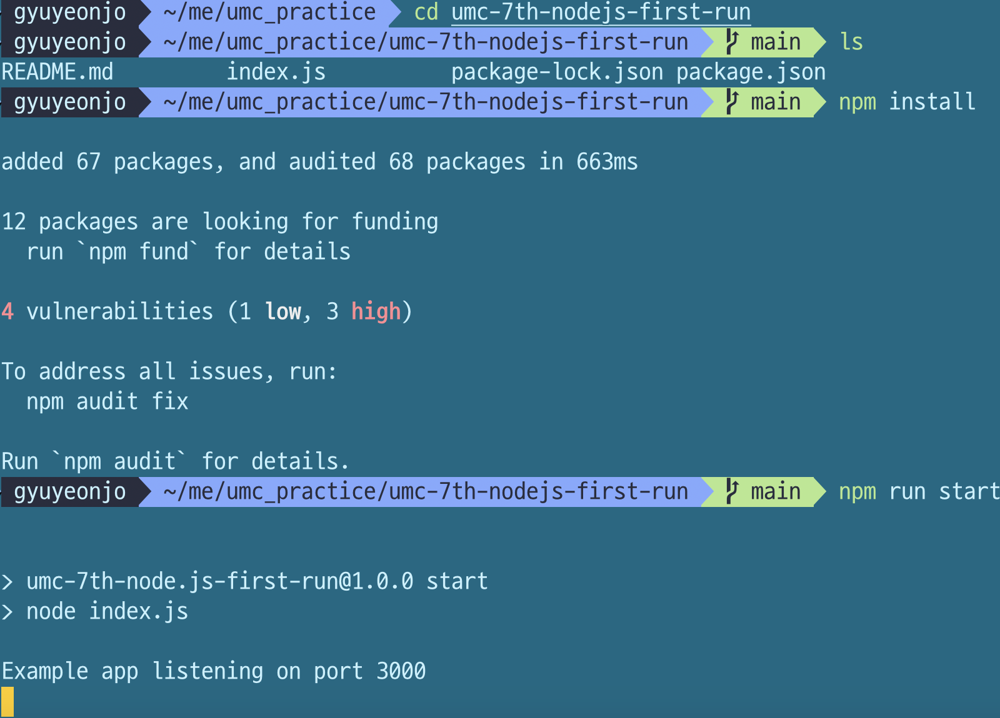
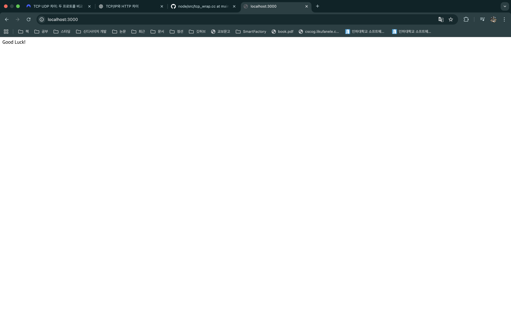

## 미션 1
1. 클라이언트 컴퓨터에서 접속망을 통해 인터넷과 연결되어있는 상태에서, 너디너리 홈페이지 url을 검색창에 넣고 검색한다.
2. url(도메인 주소)가 DNS 서버를 통해 해당되는 ip 주소로 바뀌고, 라우터가 해당 ip 주소를 통해 네트워크 간의 연결을 이뤄준다.
3. 클라이언트와 서버 간의 안정적인 연결을 위해 연결지향적인 TCP(전송 제어 프로토콜)를 사용해 데이터를 패킷 단위로 전송한다.
4. 클라이언트에서는 그 전송받은 패킷들을 모아서 순서를 재조립하고 데이터가 잘 왔는지 검증하기도 함으로써 데이터의 완전성을 검증한다.

## 미션 2

1. git clone

2. 의존성 설치 및 서버 실행

3. 결과 확인

