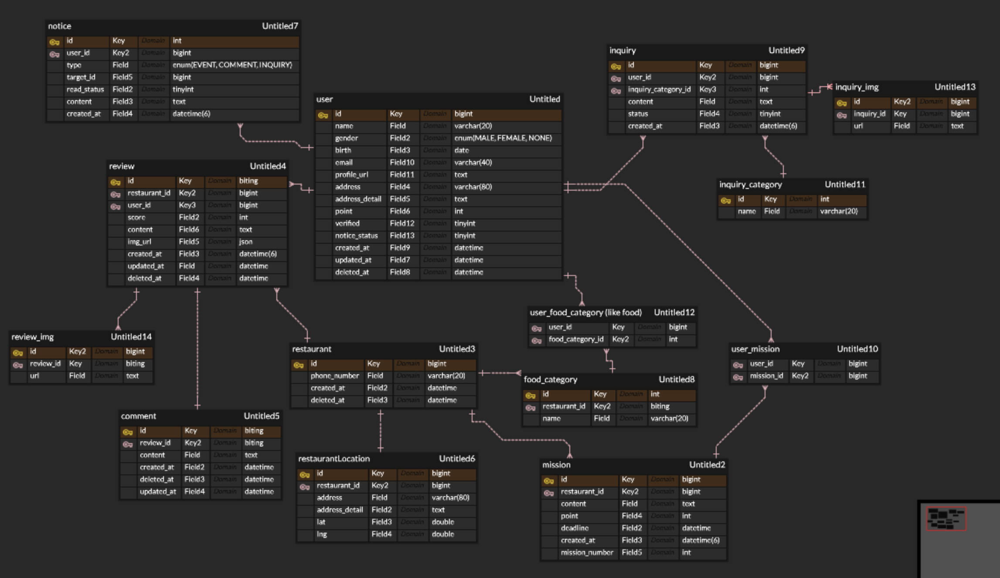
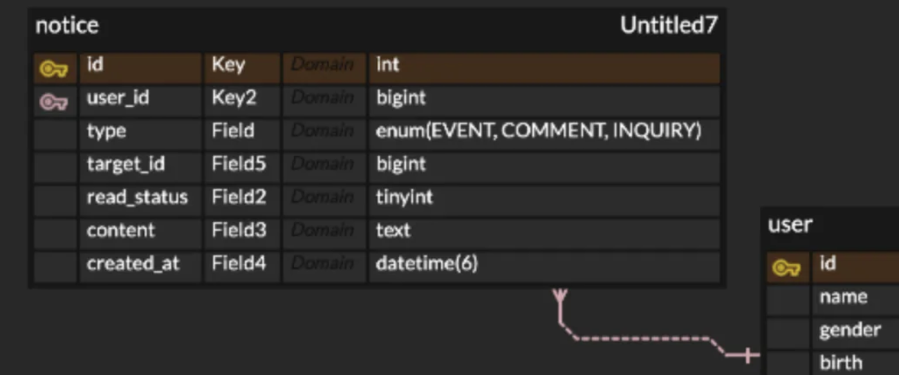

## 1. ERD

        
## 2. 정규화 과정
### 제1정규형

> 모든 속성은 단일 값을 가져야한다.
> 
- inquiry 테이블에 복수개의 이미지를 넣기 위해 처음에 json 배열로 넣었는데, 이는 다중값이다. 이를 해결하기 위해 inquiry_img 테이블을 따로 만들었다.
- 주소같은 경우도 address, address_detail, lng, lat로 분리

### 제2정규형

> 기본키의 부분집합에 종속된 속성을 제거해야 한다.
> 
- user_mission을 처음부터 다대다(1:N:N:1)로 설계했지만, 그렇게 하지 않아서 user_mission 테이블에 user의 name이나 mission의 content같은게 들어갔다면 부분집합에 종속되게 된다.

| user_id | mission_id | user_name> user에만 종속 | user_email > user에만 종속 | mission_content > mission에만 종속 | … |
| --- | --- | --- | --- | --- | --- |

### 제3정규형

> 테이블의 키가 아닌 모든 속성들이 기본 키에 이행적으로 함수종속되지 않은 관계가 있다면 분리해야한다.

알람 테이블의 필드에 알람타입과, 그에 해당하는 target_id가 있음. 이는 3정규형에 위배. type이 미션일때 `target_id → mission_id`, 리뷰일때 `target_id → review_id` 처럼 종속 관계가 숨겨져있음
- 해결하기 위해 알람 테이블을 종류별로 따로 만들기(분리!)

## 3. 중복 요청 방지
### 프론트엔드

- 버튼을 비활성화 하기
- 일정시간 내 여러 번 클릭 시 무시 / 빠른 연속 입력 차단 로직을 추가

### 서버

- 미션을 단위를 트랜잭션으로 처리하여 한 사람이 동일한 미션을 동시에 insert하지 못하도록 한다.
- 미션에 해당하는 고유한 키를 포함하여 API를 요청하여, 중복 요청인지 서버에서 판단한다.